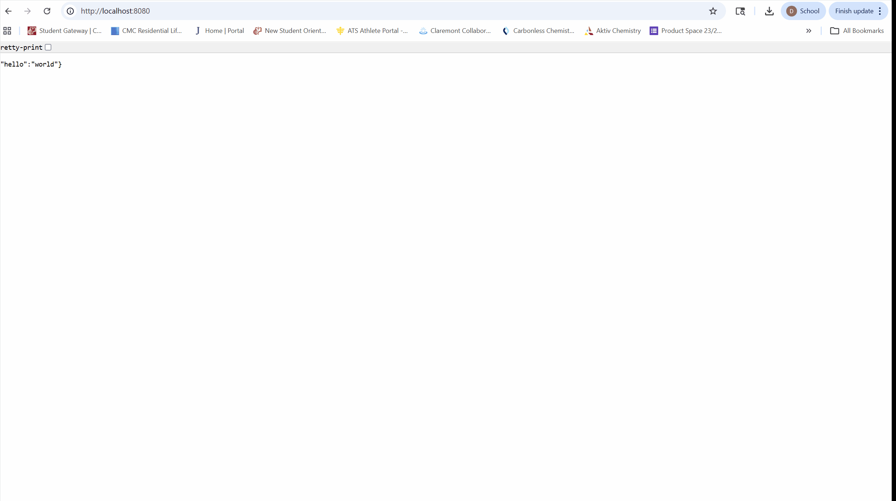

# flask-on-docker


This repository allows you to run a Flask app using Docker containers as well as a PostGreSQL database and other resources. There are two configuration files as well as two Dockerfiles which help to build Docker container images, one for development and one for production. The production configuration allows Flask to run with Gunicorn and Nginx. This repository provides a simple format for learning how to use these applications. When visiting the webpage produced by the app, a simple message is displayed to show it is working properly. Gunicorn and Nginx are used to help manage the Flask app and handle static or media files. This allows the webpage to reference files from inside the code as well as those uploaded by users. The resources inside this repository provide a good starting point for developing a Python web application. 



Below are instructions for how utilize the services contained in the repository. Fork this repo, and clone it onto your server. From inside you can run these commands to build the docker containers. 

```
$ docker compose down -v
$ docker compose -f docker-compose.prod.yml up -d --build
$ docker compose -f docker-compose.prod.yml exec web python manage.py create_db
```
You should establish another connection to your server using the localhost:8080 address as well as port 1302 for your server's IP address. You can then access the website <http://localhost:8080> to view the app. The media and static extensions can be used to view files. 
